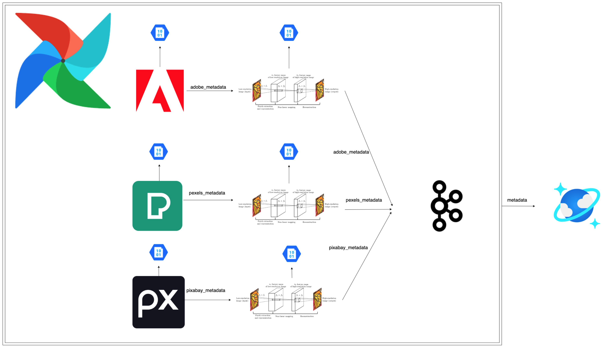
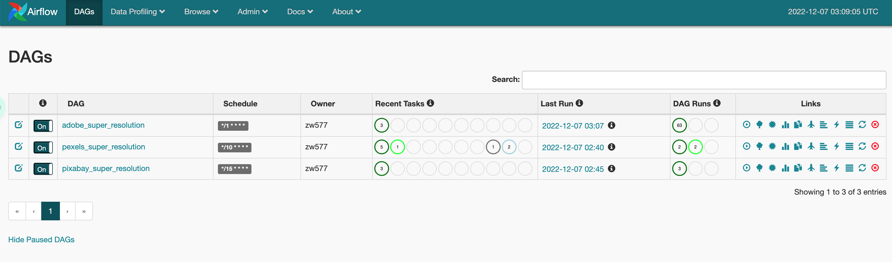
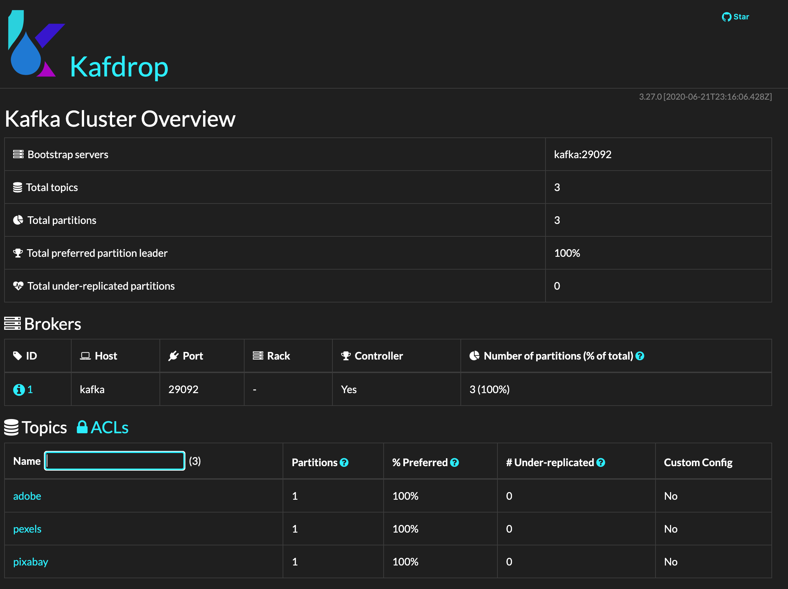
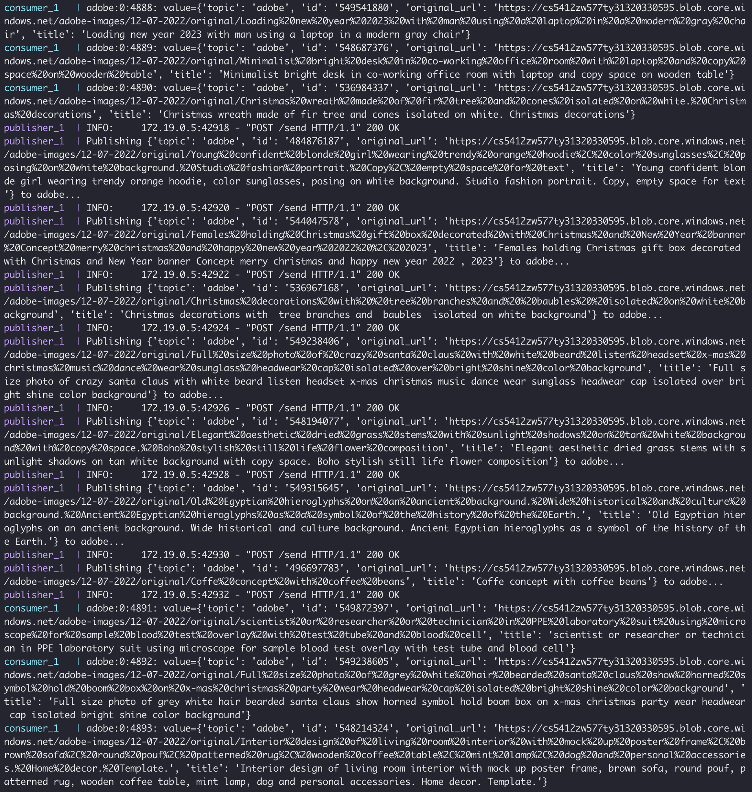
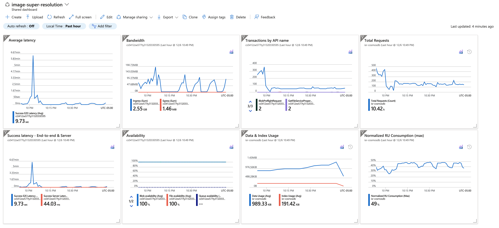

Image Super Resolution
---
<!-- TABLE OF CONTENTS -->
<details>
  <summary>Table of Contents</summary>
  <ol>
    <li><a href="#about-the-project">About The Project</a></li>
    <li><a href="#architecture">Architecture</a></li>
    <li>
      <a href="#getting-started">Getting Started</a>
      <ul>
        <li><a href="#prerequisites">Prerequisites</a></li>
        <li><a href="#build">Build</a></li>
        <li><a href="#usage">Usage</a></li>
      </ul>
    </li>
    <li><a href="#running-other-airflow-commands">Running Other Airflow Commands</a></li>
  </ol>
</details>

## About The Project
Image Super Resolution(ISR) is an ML pipeline that extracts the raw images from various open image stocks, 
trains to super-resolution(sr) images, and loads them into cloud storage. We built ISR on top of Apache Airflow,
Apache Kafka, Azure Blob and Cosmos, and SRCNN. In this dataflow, we periodically fetch the source images using 
Open APIs provided by Adobe, Pexels, and Pixabay, model to SR images by PyTorch SRCNN, and upload raw and SR 
images to Azure Blob and connect image metadata to Azure Cosmos DB.

<p align="right">(<a href="#readme-top">back to top</a>)</p>

## Architecture
  <a href="https://github.com/Zhaoyu-W/image-super-resolution/docs/architecture.png">
    
  </a>

## Getting Started
### Prerequisites

- Install [Docker](https://www.docker.com/)
- Install [Docker Compose](https://docs.docker.com/compose/install/)

### Build
```
git clone https://github.com/Zhaoyu-W/image-super-resolution
docker-compose build
```

<p align="right">(<a href="#readme-top">back to top</a>)</p>

### Usage

- Run the web service with docker
```
docker-compose up -d
```
- Check out airflow UI website on http://localhost:8080/
  <a href="https://github.com/Zhaoyu-W/image-super-resolution/docs/kafdrop.png">
    
  </a>
- Trigger the DAGs
- Check out kafdrop UI website on http://localhost:9000/
  <a href="https://github.com/Zhaoyu-W/image-super-resolution/docs/kafdrop.png">
    
  </a>

- Check out log output
```
docker-compose logs --tail 100
```
- If you see the logs from publisher and consumer, ISR is working well! 
  <a href="https://github.com/Zhaoyu-W/image-super-resolution/docs/logs.png">
    
  </a>
- List containers
```
docker-compose ps
```
- Stop containers
```
docker-compose down
```

<p align="right">(<a href="#readme-top">back to top</a>)</p>

## Monitoring
We evaluate the performance and monitor metrics for Azure Blog and Cosmos DB. You can customize 
metrics you want on Azure Dashboard, like latency, availability, bandwidth, etc.
  <a href="https://github.com/Zhaoyu-W/image-super-resolution/docs/azure_monitoring.png">
    
  </a>

## Running Other Airflow Commands

If you want to run airflow sub-commands, you can do so like this:

- List dags: `docker-compose run --rm webserver airflow list_dags`
- Test specific task: `docker-compose run --rm webserver airflow test [DAG_ID] [TASK_ID] [EXECUTION_DATE]`

If you want to run/test python script, you can do so like this:
- Test python script: `docker-compose run --rm webserver python /usr/local/airflow/pipeline/[PYTHON-FILE].py` 

<p align="right">(<a href="#readme-top">back to top</a>)</p>
